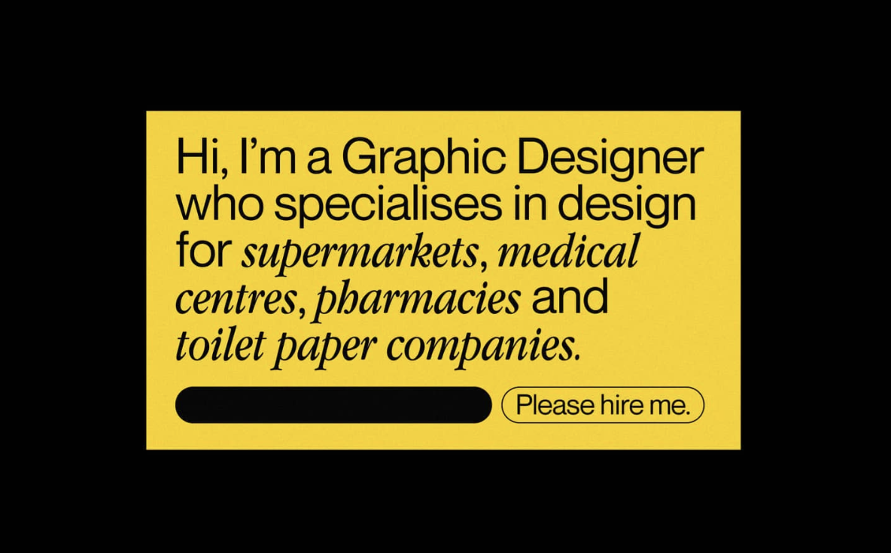

# :partying_face: Pseudo-Party

Heute werden wir mit Pseudo-Klasses stylen... yay!

Das Tagesziel:

1. [Pseudo-Input](https://github.com/AmyraRadwan/Pseudo-Class-Party/tree/main#1-pseudo-input)

   - [Was sind Pseudo-Klassen?](https://github.com/AmyraRadwan/Pseudo-Class-Party#face_with_spiral_eyes-was-sind-pseudo-klassen)
   - [Was sind Pseudo-Elemente?](https://github.com/AmyraRadwan/Pseudo-Class-Party#face_with_spiral_eyes-was-sind-pseudo-elemente)

2. [Pseudo-Index](https://github.com/AmyraRadwan/Pseudo-Class-Party/tree/main#2-pseudo-index)

   - [Tolle Pseudo-Klassen](https://github.com/AmyraRadwan/Pseudo-Class-Party/tree/main#sparkles-tolle-pseudo-klassen)
   - [Tolle Pseudo-Elemente](https://github.com/AmyraRadwan/Pseudo-Class-Party/tree/main#sparkles-tolle-pseudo-elemente)

3. [Aufgabe - "Hey, I'm a graphic designer ..."](https://github.com/AmyraRadwan/Pseudo-Class-Party/tree/main#3-aufgabe---hey-im-a-graphic-designer-)

   - [Aufgabenstellung](https://github.com/AmyraRadwan/Pseudo-Class-Party/tree/main#page_facing_up-aufgabenstellung)
   - [Beispiele & Ressourcen](https://github.com/AmyraRadwan/Pseudo-Class-Party/tree/main#bulb-beispiele--ressourcen)

Auf geht's!

# 1. Pseudo-Input

## :face_with_spiral_eyes: Was sind Pseudo-Klassen?

CSS Pseudo-Klassen sind Keywords mit einem Doppelpunkt davor, die sich auf bestimmte Zustände von Elementen beziehen. Bei `:hover` wird z.B. ein Maus abhängiger Zustand angesprochen. Pseudo-Klassen bestehen aus einem Doppelpunkt `:` gefolgt von einem Namen (z.B., `:hover`).

### Syntax

```
selector:pseudo-class {
  property: value;
}
```

Es gibt funktionale Pseudo-Klassen mit Klammern dahinter die Argumente enthalten (z.B., `:dir()`). Das Element auf das sich die Pseudo-Klasse bezieht nennt man _anchor element_ (z.B., `button` bei `button:hover`).

Mit Pseudo-Klassen lassen sich nicht nur Elemente in Relation zum inhaltlichen HTML Dokumentaufbau stylen sondern auch in Relation zu externen Faktoren wie die Interaktion von Nutzer\*innen (z.B., `:visited`), den Status des Inhalts (z.B., `:checked`) oder die Position der Maus (z.B., `:hover`).

## :face_with_spiral_eyes: Was sind Pseudo-Elemente?

CSS Pseudo-Elemente sind Keywords die zu einem Selektor hinzugefügt werden um damit einen speziellen Teil des Elements zu stylen. `::first-line` z.B. wird benutzt um die erste Zeile eines Paragraphen zu stylen. Pseudo-Elemente bestehen aus zwei Doppelpunkten `::` gefolgt von dem Namen (z.B., `::marker`).

### Syntax

```
selector::pseudo-element {
  property: value;
}
```

Die ersten Pseudo-Klassen wurden 1996 mit CSS1 herausgebracht. Pseudo soll hier soviel bedeuten wie falsch, unreal, oder fake. Der Prefix Pseudo- wird somit verwendet um Klassen und Elemente zu referenzieren die nicht "real" sind. Nicht real bedeutet in dem Kontext nicht Teil des DOM (Document Object Model) sondern virtuell erzeugte Elemente/Klassen die nur zu styling Zwecken kreiert werden.

# 2. Pseudo-Index

## :sparkles: Tolle Pseudo-Klassen

Sorry, für zu faul. Hier der Link zum nachlesen: [MDN Web Docs: Pseudo-Klassen](https://developer.mozilla.org/en-US/docs/Web/CSS/Pseudo-classes)

## :sparkles: Tolle Pseudo-Elemente

### ::before

Mit `::before` wird ein Pseudo-Element erstellt, das als first-child des Selektor-Elements fungiert. Es wird häufig verwendet, um einem Element mit der Eigenschaft `content` kosmetische Inhalte hinzuzufügen. Es ist standardmäßig ein Inline-Element.

**Beispiel:**

```
.class::before {
    content: "💥";
}
```

### ::after

Mit `::after` wird ein Pseudoelement erstellt, das als last-child des Selektor-Elements fungiert. Es wird häufig verwendet, um einem Element mit der Eigenschaft `content` kosmetische Inhalte hinzuzufügen. Es ist standardmäßig Inline-Element.

**Beispiel:**

```
.class::after {
    content: "✋";
}
```

### ::first-letter

Das `::first-letter` Pseudo-Element wendet Stile auf den ersten Buchstaben der ersten Zeile eines Block-Elements an, jedoch nur, wenn kein anderer Inhalt (wie Bilder oder Inline-Tabellen) vorangestellt ist. Da es sich um ein Inline-Text Pseudo-Element handelt können nur bestimmte Properties damit gestyled werden.

**Beispiel:**

```
p::first-letter {
    font-size: 2em;
    line-height: 2.5em;
    float: left;
}
```

### ::first-line

Das `::first-line` Pseudo-Element wendet Stile auf die erste Zeile eines Block-Elements an. Es ist standardmäßig ein Inline-Element. Da es sich um ein Inline-Text Pseudo-Element handelt können nur bestimmte Properties damit gestyled werden.

**Beispiel:**

```
p::first-line {
    font-weight: 900;
}
```

### ::marker

Mit dem `::marker` Pseudo-Element lassen sich die standardmäßigen Symbole der Listenelemente `<li>` auswechseln. Es funktioniert bei allen Elementen die auf `display: list-item` eingestellt sind (standardmäßig z.B., `<li>` und `<summary>` Elemente). Nur bestimmte Properties lassen sich mit `::marker` stylen.

**Beispiel:**

```
li::marker {
    content: '✝';
    font-size: 1.2em;
}
```

### ::selection

Mit dem `::selection` Pseudo-Element lassen sich die Farben der von Benutzer\*innen markierten Stellen eines Elements (z. B. durch klicken und ziehen der Maus über den Text) stylen. Nur bestimmte Properties lassen sich mit `::selection` stylen: `color`, `background-color`, `text-decoration`, `text-shadow`, `-webkit-text-stroke-color`, `-webkit-text-fill-color` and `-webkit-text-stroke-width`.

**Beispiel:**

```
p::selection {
    color: red;
    background-color: yellow;
}
```

# 3. Aufgabe - "Hey, I'm a graphic designer ..."

## :page_facing_up: Aufgabenstellung

Wir beschäftigen uns heute mit dem für Portfolio Seiten klassischen Phänomen der "About Me" Webseiten. Seit es soziale Netzwerke wie Frienster, StudiVZ, MySpace und LinkedIn gibt, geht es im WWW verstärkt darum Profile mit persönlichen Daten auszuschmücken, um die Außenwirkung zu pflegen. Dieses Konzept findet sich auch auf vielen Portfolio-Webseiten, bei denen es primär darum geht, sich selbst zu vermarkten und darzustellen. Eine beliebte und simple Methode, die sich tausendfach anwenden lässt und meistens mit dem Satz: "Hey, I'm a graphic designer ..." beginnt. Heute coden wir so eine tolle Freundebuch-Style-Webseite selbst und setzen dabei alle Pseudo-Klassen und Elemente ein, die wir kennen.



1. Ladet euch [hier](https://filedn.eu/l22VWjpcjpkLIdEj2qq1KKV/pseudo-party-vorlage.zip) die Vorlage herunter
2. Füllt die Vorlage nach Belieben mit euren eigenen Inhalten. Fügt gerne weiteres hinzu und löscht unnötiges heraus
3. Nutzt die gelernten Pseudo-Klassen und Elemente, um User-Interaktion und kleine Spielereien einzubauen. Wenn ihr unsicher mit der Syntax oder Funktionalität seit schaut hier im Repro nach oder fragt einfach
4. Um 12.30 Uhr machen wir eine schnelle Präsentation der Ergebnisse

## :bulb: Beispiele & Ressourcen

1. Beispiele

   - [mindyseu.com](https://mindyseu.com/)
   - [zweifel.jetzt](https://www.zweifel.jetzt/simon-wahlers)
   - [roopavasudevan.com](https://roopavasudevan.com/)
   - [loonatiks.gr](https://loonatiks.gr/)
   - [studiotriple.fr](http://studiotriple.fr/)
   - [heyimphil.com](https://heyimphil.com/)
   - [janniswichmann.com](https://janniswichmann.com/de)
   - [fraukeschnoor.de](https://www.fraukeschnoor.de/)
   - [oldsite.sallythurer.com](https://oldsite.sallythurer.com/)

2. Ressourcen
   - [MDN Web Docs: Pseudo-Klassen](https://developer.mozilla.org/en-US/docs/Web/CSS/Pseudo-classes)
   - [MDN Web Docs: Pseudo-Elemente](https://developer.mozilla.org/en-US/docs/Web/CSS/Pseudo-elements)
   - [Kevin Powell: Before and After pseudo-elements explained - Part 1](https://www.youtube.com/watch?v=zGiirUiWslI)
   - [Kevin Powell: Before and After pseudo-elements explained - Part 2](https://www.youtube.com/watch?v=xoRbkm8XgfQ)
   - [Kevin Powell: Before and After pseudo-elements explained - Part 3](https://www.youtube.com/watch?v=djbtPnNmc0I)
   - [Kevin Powell: :is() :where() :has() pseudo-classes explained](https://www.youtube.com/watch?v=3ncFpP8GP4g)
   - [Kevin Powell: :has() opens up new possibilities](https://www.youtube.com/watch?v=OGJvhpoE8b4)
   - [Simple Emoji Animations](https://codepen.io/GeorgePark/pen/aazBGj)
